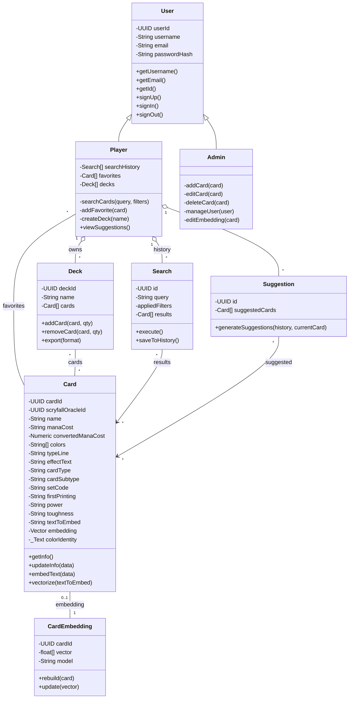

```mermaid

classDiagram
    class User {
        -UUID userId
        -String username
        -String email
        -String passwordHash
        +getUsername()
        +getEmail()
        +getId()
        +signUp()
        +signIn()
        +signOut()
    }

    class Player {
        -Search[] searchHistory
        -Card[] favorites
        -Deck[] decks
        -searchCards(query, filters)
        -addFavorite(card)
        -createDeck(name)
        +viewSuggestions()
    }

    class Admin {
        -addCard(card)
        -editCard(card)
        -deleteCard(card)
        -manageUser(user)
        -editEmbedding(card)
    }

    User <|-- Player
    User <|-- Admin


    class Card {
        -UUID cardId
        -UUID scryfallOracleId
        -String name
        -String manaCost
        -Numeric convertedManaCost
        -String[] colors
        -String typeLine
        -String effectText
        -String cardType
        -String cardSubtype
        -String setCode
        -String firstPrinting
        -String power
        -String toughness
        -String textToEmbed
        -Vector embedding
        -_Text colorIdentity
        +getInfo()
        +updateInfo(data)
        +embedText(data)
        +vectorize(textToEmbed)
    }

    class Deck {
        -UUID deckId
        -String name
        -Card[] cards
        +addCard(card, qty)
        +removeCard(card, qty)
        +export(format)
    }

    class Search {
        -UUID id
        -String query
        -appliedFilters
        -Card[] results
        +execute()
        +saveToHistory()
    }

    class Suggestion {
        -UUID id
        -Card[] suggestedCards
        +generateSuggestions(history, currentCard)
    }

    class CardEmbedding {
        -UUID cardId
        -float[] vector
        -String model
        +rebuild(card)
        +update(vector)
    }


    Player "1" o-- "*" Search : history
    Player "1" o-- "*" Deck : owns
    Player "*" -- "*" Card : favorites
    Deck "*" -- "*" Card : cards
    Search "*" --> "*" Card : results
    Player "1" o-- "*" Suggestion
    Suggestion "*" --> "*" Card : suggested
    Card "0..1" -- "1" CardEmbedding : embedding

```