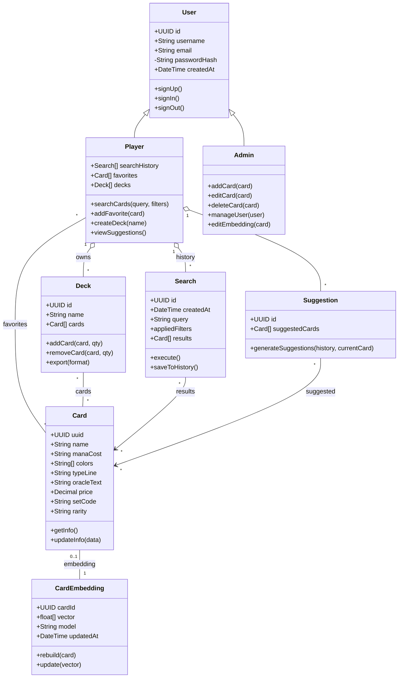

```mermaid

classDiagram
    class User {
        +UUID id
        +String username
        +String email
        -String passwordHash
        +DateTime createdAt
        +signUp()
        +signIn()
        +signOut()
    }

    class Player {
        +Search[] searchHistory
        +Card[] favorites
        +Deck[] decks
        +searchCards(query, filters)
        +addFavorite(card)
        +createDeck(name)
        +viewSuggestions()
    }

    class Admin {
        +addCard(card)
        +editCard(card)
        +deleteCard(card)
        +manageUser(user)
        +editEmbedding(card)
    }

    User <|-- Player
    User <|-- Admin


    class Card {
        +UUID uuid
        +String name
        +String manaCost
        +String[] colors
        +String typeLine
        +String oracleText
        +Decimal price
        +String setCode
        +String rarity
        +getInfo()
        +updateInfo(data)
    }

    class Deck {
        +UUID id
        +String name
        +Card[] cards
        +addCard(card, qty)
        +removeCard(card, qty)
        +export(format)
    }

    class Search {
        +UUID id
        +DateTime createdAt
        +String query
        +appliedFilters
        +Card[] results
        +execute()
        +saveToHistory()
    }

    class Suggestion {
        +UUID id
        +Card[] suggestedCards
        +generateSuggestions(history, currentCard)
    }

    class CardEmbedding {
        +UUID cardId
        +float[] vector
        +String model
        +DateTime updatedAt
        +rebuild(card)
        +update(vector)
    }


    Player "1" o-- "*" Search : history
    Player "1" o-- "*" Deck : owns
    Player "*" -- "*" Card : favorites
    Deck "*" -- "*" Card : cards
    Search "*" --> "*" Card : results
    Player "1" o-- "*" Suggestion
    Suggestion "*" --> "*" Card : suggested
    Card "0..1" -- "1" CardEmbedding : embedding

```