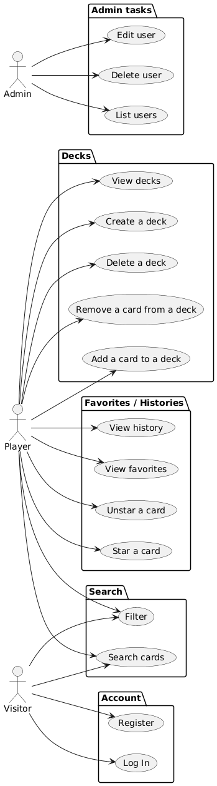

-------------

OR :

@startuml
' paste here to visualize : https://www.plantuml.com/plantuml/uml/SyfFKj2rKt3CoKnELR1Io4ZDoSa70000
' doc : https://plantuml.com/fr/use-case-diagram

left to right direction

actor "User"    as user
actor "Admin"   as admin

rectangle {
  usecase "Sign up"    as signup
  usecase "Search"     as search
  usecase "Create a deck" as create_deck
  usecase "View decks" as view_decks
  usecase "Star a card" as star_card
  usecase "View history" as view_history
}

rectangle {
  usecase "Log In"     as login
  usecase "Log Out"    as logout
}

rectangle {
 usecase "Add card" as add_card
 usecase "Delete card" as delete_card
 usecase "Edit card" as edit_card
 usecase "Ban user" as ban_user
 usecase "Edit user" as edit_user
}

user --> signup
user --> login
user --> logout
user --> search
user --> create_deck
user --> view_decks
user --> star_card
user --> view_history

admin --> delete_card
admin --> add_card
admin --> edit_card
admin --> ban_user
admin --> edit_user

admin --> login
admin --> logout
user --> login
user --> logout
@enduml