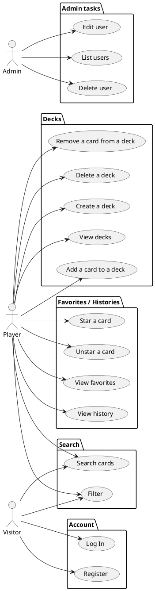

-------------

OR :

```plantuml
@startuml

' paste here to visualize : https://www.plantuml.com/plantuml/uml/SyfFKj2rKt3CoKnELR1Io4ZDoSa70000
' doc : https://plantuml.com/fr/use-case-diagram

left to right direction

actor Player
actor Admin
actor Visitor

package "Account" {
    usecase "Log In" as login
    usecase "Register" as register
}

package "Admin tasks" {
    usecase "Delete user" as delete_user
    usecase "Edit user" as edit_user
    usecase "List users" as list_users
}

package "Decks" {
    usecase "Create a deck" as create_deck
    usecase "View decks" as view_decks
    usecase "Add a card to a deck" as add_card_to_deck
    usecase "Remove a card from a deck" as remove_card_from_deck
    usecase "Delete a deck" as delete_deck
}

package "Favorites / Histories" {
    usecase "Star a card" as star_card
    usecase "Unstar a card" as unstar_card
    usecase "View favorites" as view_favorites
    usecase "View history" as view_history
}

package "Search" {
    usecase "Search cards" as search
    usecase "Filter" as filter
}

Player --> filter
Player --> search
Player --> add_card_to_deck
Player --> remove_card_from_deck
Player --> star_card
Player --> unstar_card
Player --> view_decks
Player --> delete_deck
Player --> view_favorites
Player --> view_history
Player --> create_deck


Visitor --> filter
Visitor --> search
Visitor --> register
Visitor --> login


Admin --> list_users
Admin --> delete_user
Admin --> edit_user

@enduml

```
