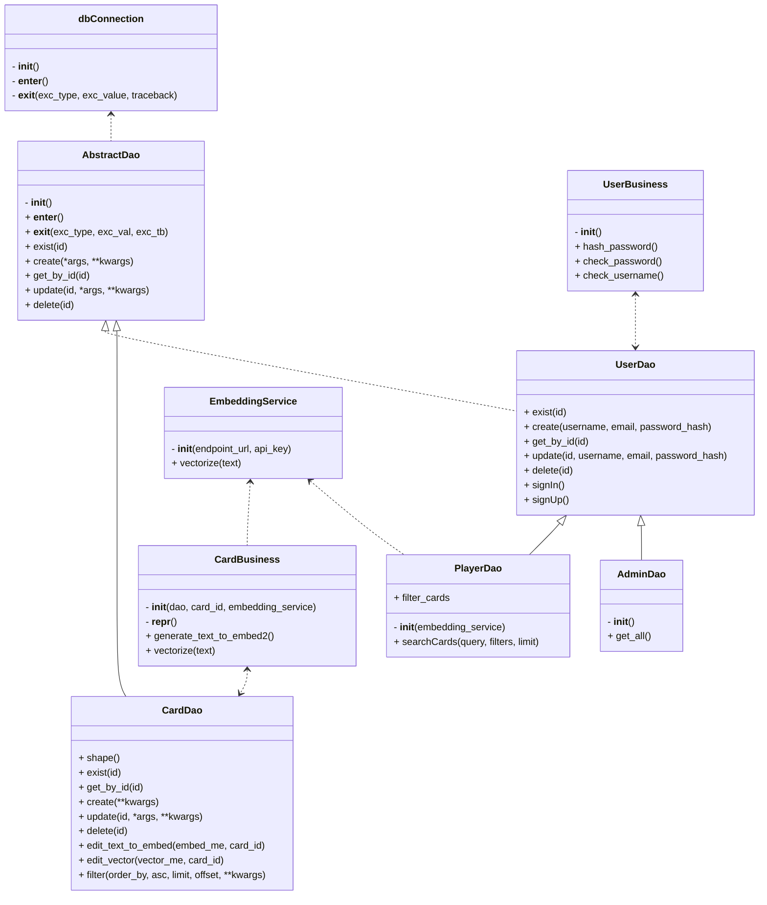

```mermaid
classDiagram
 %% === DAO Layer ===
    class AbstractDao {
        - __init__()
        + __enter__()
        + __exit__(exc_type, exc_val, exc_tb)
        + exist(id)
        + create(*args, **kwargs)
        + get_by_id(id)
        + update(id, *args, **kwargs)
        + delete(id)
    }

    class UserDao {
        + exist(id)
        + create(username, email, password_hash)
        + get_by_id(id)
        + update(id, username, email, password_hash)
        + delete(id)
        + signIn()
        + signUp()
    }

    class PlayerDao{
        - __init__(embedding_service)
        + filter_cards
        + searchCards(query, filters, limit)
    }

    class AdminDao{
        - __init__()
        + get_all()
    }

    class CardDao{
        + shape()
        + exist(id)
        + get_by_id(id)
        + create(**kwargs)
        + update(id, *args, **kwargs)
        + delete(id)
        + edit_text_to_embed(embed_me, card_id)
        + edit_vector(vector_me, card_id)
        + filter(order_by, asc, limit, offset, **kwargs)
    }


%% === Business Layer ===
    class CardBusiness{
        - __init__(dao, card_id, embedding_service)
        - __repr__()
        + generate_text_to_embed2()
        + vectorize(text)
    }

    class UserBusiness{
        - __init__()
        + hash_password()
        + check_password()
        + check_username()
    }

%% === Service Layer ===
    class EmbeddingService{
        - __init__(endpoint_url, api_key)
        + vectorize(text)
    }


%% === Utils Layer ===
    class dbConnection{
        - __init__()
        - __enter__()
        - __exit__(exc_type, exc_value, traceback)
    }

UserDao <|-- AdminDao
UserDao <|-- PlayerDao
EmbeddingService <.. PlayerDao
EmbeddingService <.. CardBusiness
CardBusiness <..> CardDao
AbstractDao <|-- CardDao
dbConnection <.. AbstractDao
AbstractDao <|.. UserDao
UserBusiness <..> UserDao
```