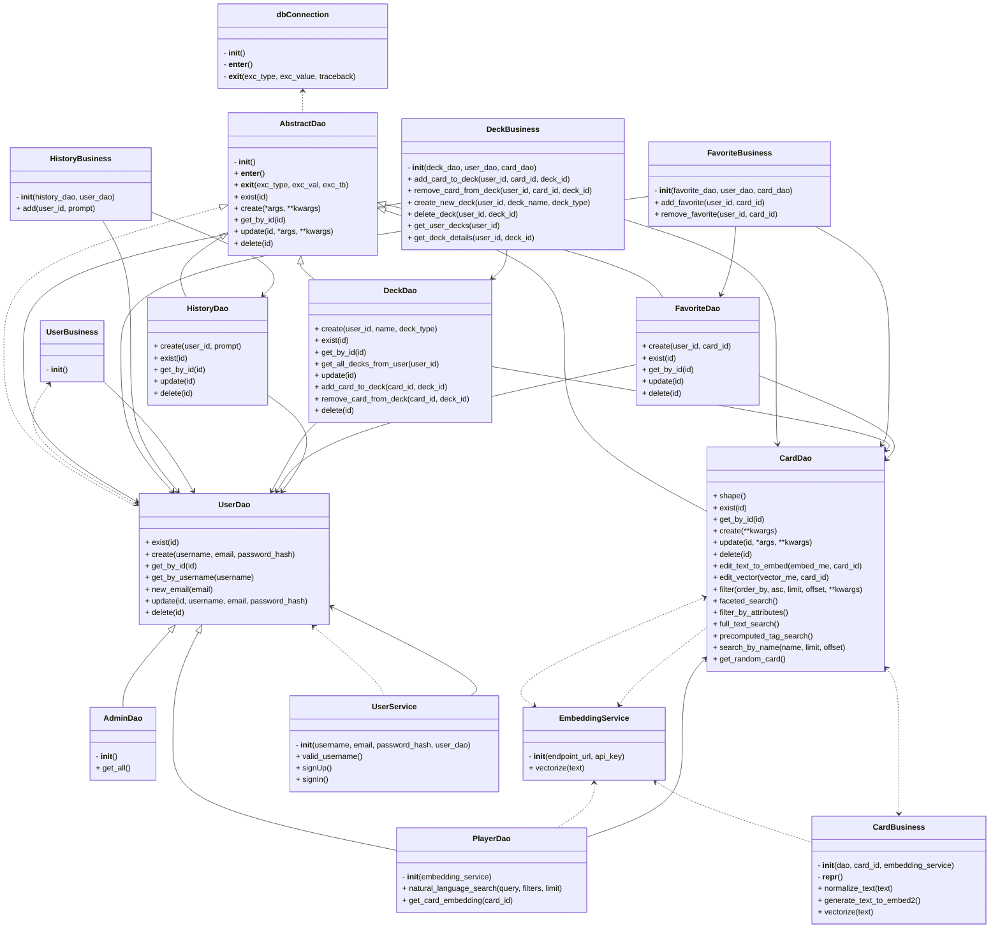

```mermaid
classDiagram
 %% === DAO Layer ===
    class AbstractDao {
        - __init__()
        + __enter__()
        + __exit__(exc_type, exc_val, exc_tb)
        + exist(id)
        + create(*args, **kwargs)
        + get_by_id(id)
        + update(id, *args, **kwargs)
        + delete(id)
    }

    class UserDao {
        + exist(id)
        + create(username, email, password_hash)
        + get_by_id(id)
        + get_by_username(username)
        + new_email(email)
        + update(id, username, email, password_hash)
        + delete(id)
    }

    class PlayerDao{
        - __init__(embedding_service)
        + natural_language_search(query, filters, limit)
        + get_card_embedding(card_id)
    }

    class AdminDao{
        - __init__()
        + get_all()
    }

    class CardDao{
        + shape()
        + exist(id)
        + get_by_id(id)
        + create(**kwargs)
        + update(id, *args, **kwargs)
        + delete(id)
        + edit_text_to_embed(embed_me, card_id)
        + edit_vector(vector_me, card_id)
        + filter(order_by, asc, limit, offset, **kwargs)
        + faceted_search()
        + filter_by_attributes()
        + full_text_search()
        + precomputed_tag_search()
        + search_by_name(name, limit, offset)
        + get_random_card()
    }

    class DeckDao{
        + create(user_id, name, deck_type)
        + exist(id)
        + get_by_id(id)
        + get_all_decks_from_user(user_id)
        + update(id)
        + add_card_to_deck(card_id, deck_id)
        + remove_card_from_deck(card_id, deck_id)
        + delete(id)
    }

    class FavoriteDao{
        + create(user_id, card_id)
        + exist(id)
        + get_by_id(id)
        + update(id)
        + delete(id)
    }

    class HistoryDao{
        + create(user_id, prompt)
        + exist(id)
        + get_by_id(id)
        + update(id)
        + delete(id)
    }


%% === Business Layer ===
    class CardBusiness{
        - __init__(dao, card_id, embedding_service)
        - __repr__()
        + normalize_text(text)
        + generate_text_to_embed2()
        + vectorize(text)
    }

    class DeckBusiness{
        - __init__(deck_dao, user_dao, card_dao)
        + add_card_to_deck(user_id, card_id, deck_id)
        + remove_card_from_deck(user_id, card_id, deck_id)
        + create_new_deck(user_id, deck_name, deck_type)
        + delete_deck(user_id, deck_id)
        + get_user_decks(user_id)
        + get_deck_details(user_id, deck_id)
    }

    class FavoriteBusiness{
        - __init__(favorite_dao, user_dao, card_dao)
        + add_favorite(user_id, card_id)
        + remove_favorite(user_id, card_id)
    }

    class HistoryBusiness{
        - __init__(history_dao, user_dao)
        + add(user_id, prompt)
    }

    class UserBusiness{
        - __init__()
    }

%% === Service Layer ===
    class EmbeddingService{
        - __init__(endpoint_url, api_key)
        + vectorize(text)
    }

    class UserService{
        - __init__(username, email, password_hash, user_dao)
        + valid_username()
        + signUp()
        + signIn()
    }


%% === Utils Layer ===
    class dbConnection{
        - __init__()
        - __enter__()
        - __exit__(exc_type, exc_value, traceback)
    }

UserDao <|-- AdminDao
UserDao <|-- PlayerDao
EmbeddingService <.. PlayerDao
EmbeddingService <.. CardBusiness
CardBusiness <..> CardDao
AbstractDao <|-- CardDao
dbConnection <.. AbstractDao
AbstractDao <|.. UserDao
UserBusiness <..> UserDao
UserDao <.. UserService
AbstractDao <|-- DeckDao
AbstractDao <|-- FavoriteDao
AbstractDao <|-- HistoryDao

DeckBusiness --> DeckDao
DeckBusiness --> UserDao
DeckBusiness --> CardDao

FavoriteBusiness --> FavoriteDao
FavoriteBusiness --> UserDao
FavoriteBusiness --> CardDao
HistoryBusiness --> HistoryDao
HistoryBusiness --> UserDao

PlayerDao --> CardDao
CardDao <..> EmbeddingService

UserBusiness --> UserDao
UserService --> UserDao
DeckDao --> UserDao
DeckDao --> CardDao
FavoriteDao --> UserDao
FavoriteDao --> CardDao
HistoryDao --> UserDao

EmbeddingService <.. CardDao

```