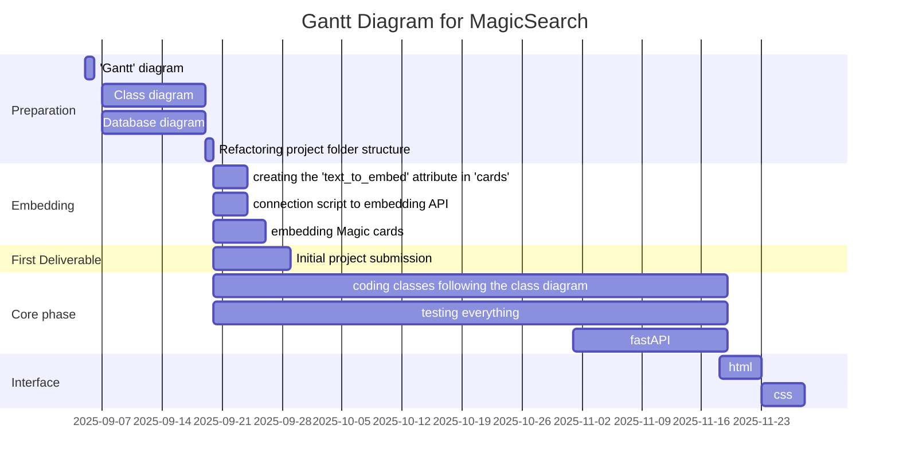

```mermaid
gantt
    title Gantt Diagram for MagicSearch
    dateFormat DD-MM-YYYY
    section Preparation
        'Gantt' diagram : a0, 05-09-2025, 1d
        Class diagram : a1, 07-09-2025, 12d
        Database diagram : a3, 07-09-2025, 12d
        Refactoring project folder structure : a4, 19-09-2025, 1d
        
    section Embedding
        creating the 'text_to_embed' attribute in 'cards' : b1, 20-09-2025, 4d
        connection script to embedding API : b2, 20-09-2025, 4d
        embedding Magic cards : b3, 20-09-2025, 6d

    section First Deliverable
        Initial project submission : c0, 20-09-2025, 9d

    section Core phase
        coding classes following the class diagram: d0, 20-09-2025, 60d
        testing everything: d1, 20-09-2025, 60d
        fastAPI: d2, 01-11-2025, 18d
    
    section Interface
        html : e0, 18-11-2025, 5d
        css : e1, 23-11-2025, 5d
```