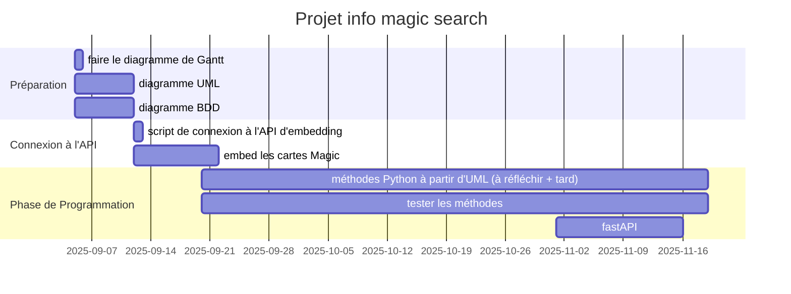

# Diagramme de Gantt du projet

```mermaid
gantt
    title Projet info magic search
    dateFormat DD-MM-YYYY
    section Préparation
        faire le diagramme de Gantt : a0, 05-09-2025,1d
        diagramme UML        :a1, 05-09-2025, 7d
        diagramme BDD        :a2, 05-09-2025, 7d
    section Connexion à l'API
        script de connexion à l'API d'embedding : b1, 12-09-2025,1d
        embed les cartes Magic: b1, 12-09-2025, 10d
    section Phase de Programmation
        méthodes Python à partir d'UML (à réfléchir + tard): c0, 20-09-2025, 60d
        tester les méthodes : c1, 20-09-2025, 60d
        fastAPI: c2, 01-11-2025, 15d

```